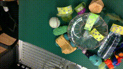
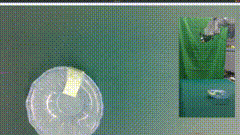
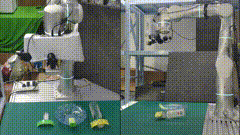
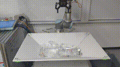
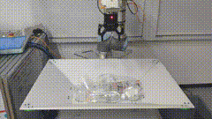
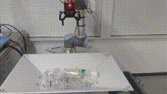

# TransCG: A Large-Scale Real-World Dataset for Transparent Object Depth Completion and A Grasping Baseline

[![CC BY-NC-SA 4.0][cc-by-nc-sa-shield]][cc-by-nc-sa]

[[Paper (IEEE Xplore)]](https://ieeexplore.ieee.org/document/9796631) [[Paper (arXiv)]](https://arxiv.org/pdf/2202.08471) [[Project Page]](https://graspnet.net/transcg)

**Authors**: [Hongjie Fang](https://github.com/galaxies99/), [Hao-Shu Fang](https://github.com/fang-haoshu), [Sheng Xu](https://github.com/XS1020), [Cewu Lu](https://mvig.sjtu.edu.cn/).

Welcome to the official repository for the TransCG paper. This repository includes the dataset and the proposed Depth Filler Net (DFNet) models.

## News

2022-10-10: New checkpoint and source code released. Check the [Quick Start](#quick-start) section for details. This checkpoint and source code fixes the shifting problem to a large extent (now only ~2cm shifting, which can be solved further using many engineering methods), and use interpolation to solve the empty hole problem. Many thanks to [@haojieh](https://github.com/haojieh) and [@mtbui2010](https://github.com/mtbui2010) for mentioning it. The new checkpoint has improved several metrics, see details in [assets/docs/DFNet.md](assets/docs/DFNet.md).

2022-10-02: For checkpoint and source code that correspond to the paper, please see [this version](https://github.com/Galaxies99/TransCG/tree/f80708ac4243e9f9d3f5a7b11afd863b21506f76) of our repository. Shifting problems in this version may be solved by calculating the difference of the average depth before and after refining, and then subtract the difference from the refining depths.

2022-09-16: New version of DFNet code is released. Many thanks to [@cxt98](https://github.com/cxt98) for fixing the bugs and [@haberger](https://github.com/haberger) for mentioning it.

2022-06-15: Our TransCG paper is published in IEEE Robotics and Automation Letters Vol. 7, No. 3, 2022, and is available at [IEEE Xplore](https://ieeexplore.ieee.org/document/9796631).

2022-06-01: Our TransCG paper is accepted by RA-L.

2022-02-17: Our paper is released on [arXiv](https://arxiv.org/pdf/2202.08471), and submitted to IEEE Robotics and Automation Letters (RA-L).

## TransCG Dataset

 TransCG dataset is now available on [official page](https://graspnet.net/transcg). TransCG dataset is the first large-scale real-world dataset for transparent object depth completion and grasping. In total, our dataset contains 57,715 RGB-D images of 51 transparent objects and many opaque objects captured from different perspectives of 130 scenes under various real-world settings. The 3D mesh model of the transparent objects are also provided in our dataset.

<table>
  <tr><td></td><td></td><td></td></tr>
  <tr><td align="center"> Daily Transparent Objects in Dataset</td><td align="center"> Real-time Tracking System</td><td align="center">Robot Collection</td></tr>
</table>

## Requirements

The code has been tested under

- Ubuntu 18.04 + NVIDIA GeForce RTX 3090 (CUDA 11.1)
- PyTorch 1.9.0

System dependencies can be installed by:

```bash
sudo apt-get install libhdf5-10 libhdf5-serial-dev libhdf5-dev libhdf5-cpp-11
sudo apt install libopenexr-dev zlib1g-dev openexr
```

Other dependencies can be installed by

```bash
pip install -r requirements.txt
```

## Run

### Quick Start

Our pretrained checkpoint is available on [Google Drive](https://drive.google.com/file/d/1deGliJDgRKxktDK4o1ap4y7L7TsRFBCe/view?usp=sharing) or [Baidu Netdisk](https://pan.baidu.com/s/1wywQqZK1nxRKwhGhpkocDw) (Code: gj3a). The checkpoint is trained with the default configuration in the `configs` folder. You can use our released checkpoints for [inference](#inference) or [testing](#testing-optional). Refer to [assets/docs/DFNet.md](assets/docs/DFNet.md) for details about the depth completion network.

### Grasping Demo

To verify the depth completion results in robotic manipulation, we select the fundamental object grasping as the downstream task of our network. Here are the grasping demos. Refer to [assets/docs/grasping.md](assets/docs/grasping.md) for details about the grasping method.

<table>
  <tr><td></td><td></td><td></td></tr>
</table>

### Configuration

You need to create a configuration file for training, testing and inference. See [assets/docs/configuration.md](assets/docs/configuration.md) for details.

### Dataset Preparation

- **TransCG** (recommended): See [TransCG Dataset](#transcg-dataset) section;
- **ClearGrasp** (syn and real): See [ClearGrasp official page](https://sites.google.com/view/cleargrasp);
- **Omniverse Object Dataset**: See [implicit-depth official repository](https://github.com/NVlabs/implicit_depth);
- **Transparent Object Dataset**: See [KeyPose official page](https://sites.google.com/view/keypose).

### Inference

For inference stage, there is a `Inferencer` class in `inference.py`, you can directly call it for inference. 

**Example**. Given an `H x W x 3` RGB image `rgb`, and an `H x W` depth image `depth` (after scaling according to camera parameters), you can use the following code to get the refined depth according to our models.

```python
from inferencer import Inferencer
# Initialize the inferencer. It is recommended to intiailize before starting your task for real-time performance.
inferencer = Inferencer(cfg_file = 'configs/inference.yaml') # Specify your configuration file here.
# Call inferencer for refined depth
refine_depth = inferencer.inference(rgb, depth)
```

For full code sample, refer to `sample_inference.py`.

### Training (Optional)

For training from scrach, you need to create a configuration file following instruction of [configuration section](#configuration). Then, execute the following commands to train your own model.

```bash
python train.py --cfg [Configuration File]
```

If you want to fine-tune your model from some checkpoints, you may need to provide `resume_lr` in configuration file. See [assets/docs/configuration.md](assets/docs/configuration.md) for details.

### Testing (Optional)

For model testing, you also need to create a configuration file following instruction of [configuration section](#configuration). Then, execute the following commands to test the model.

```bash
python test.py --cfg [Configuration File]
```

**Note**. For testing stage, the checkpoint specified in the configuration file should exist.

## Citation

```bibtex
@ARTICLE{fang2022transcg,
    author  = {Fang, Hongjie and Fang, Hao-Shu and Xu, Sheng and Lu, Cewu},
    journal = {IEEE Robotics and Automation Letters}, 
    title   = {TransCG: A Large-Scale Real-World Dataset for Transparent Object Depth Completion and a Grasping Baseline}, 
    year    = {2022},
    volume  = {7},
    number  = {3},
    pages   = {7383-7390},
    doi     = {10.1109/LRA.2022.3183256}
}
```

## License

This work is licensed under a
[Creative Commons Attribution-NonCommercial-ShareAlike 4.0 International License][cc-by-nc-sa].

[![CC BY-NC-SA 4.0][cc-by-nc-sa-image]][cc-by-nc-sa]

[cc-by-nc-sa]: http://creativecommons.org/licenses/by-nc-sa/4.0/
[cc-by-nc-sa-image]: https://licensebuttons.net/l/by-nc-sa/4.0/88x31.png
[cc-by-nc-sa-shield]: https://img.shields.io/badge/License-CC%20BY--NC--SA%204.0-lightgrey.svg