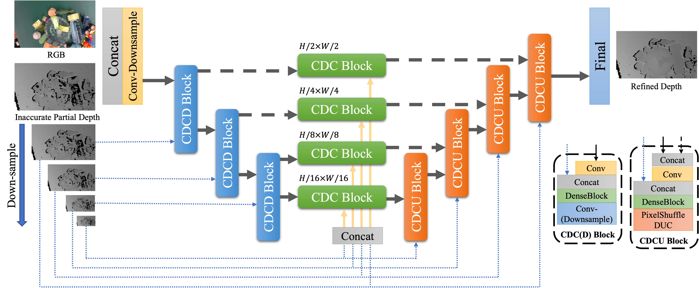

# Depth Filler Net (DFNet)

## Model

The architecture of our proposed end-to-end depth completion network DFNet is shown as follows. Our network utilizes a U-Net architecture with CDCD blocks, CDC blocks and CDCU blocks. These blocks are mainly composed of dense blocks, with DUC replacing deconvolution layer in up-sampling of CDCU block. All convolution layers except the last one are followed by batch normalizations and ReLU activations, and have 3 × 3 kernels.

**Note**. The final ReLU activations is used to guarantee that the refined depth is non-negative.

## Experiments

|  Method   | RMSE | REL | MAE | Delta 1.05 | Delta 1.10 | Delta 1.25 | GPU Mem. Occ. | Infer. Time | Model Size |
| ---- | ---- | ---- | ---- | ---- | ---- | ---- | ---- | ---- | ---- |
| ClearGrasp [1] | 0.054 | 0.083 | 0.037 | 50.48 | 68.68 | 95.28 | 2.1 GB | 2.2813s | 934 MB |
| LIDF-Refine [2] | 0.019 | 0.034 | 0.015 | 78.22 | 94.26 | **99.80** | 6.2 GB | 0.0182s | 251 MB |
| TranspareNet* [3] | 0.026 | **0.023** | 0.013 | **88.45** | **96.25** | 99.42 | 1.9 GB | 0.0354s | 336 MB |
| DFNet** (ours) | **0.018** | 0.027 | **0.012** | 83.70 | 95.96 | 99.72 | **1.6 GB** | **0.0166s** | **5.2MB** |

*: TranspareNet [3] is a concurrent work with our project.

**: Here, we use the newly released checkpoint of DFNet, which is slightly different from the checkpoint used in the paper. The newly released checkpoint fixes the bugs of point cloud shifting mentioned in [Issue #4](https://github.com/Galaxies99/TransCG/issues/4). For original checkpoint, please use [this version](https://github.com/Galaxies99/TransCG/tree/f80708ac4243e9f9d3f5a7b11afd863b21506f76) of the repository, and see [Google Drive](https://drive.google.com/file/d/1APIuzIQmFucDP4RcmiNV-NEsQKqN9J57/view?usp=sharing) or [Baidu Netdisk](https://pan.baidu.com/s/14khejj63OjOKsyzxnuYo5Q) (Code: c01g) for downloading it. Many thanks to [@cxt98](https://github.com/cxt98) for fixing the bugs in [Issue #5](https://github.com/Galaxies99/TransCG/issues/5).

## References

1. Sajjan, Shreeyak, et al. "Clear grasp: 3d shape estimation of transparent objects for manipulation." 2020 IEEE International Conference on Robotics and Automation (ICRA). IEEE, 2020.
2. Zhu, Luyang, et al. "RGB-D Local Implicit Function for Depth Completion of Transparent Objects." Proceedings of the IEEE/CVF Conference on Computer Vision and Pattern Recognition. 2021.
3. Xu, Haoping, et al. "Seeing Glass: Joint Point-Cloud and Depth Completion for Transparent Objects." 5th Annual Conference on Robot Learning. 2021.
