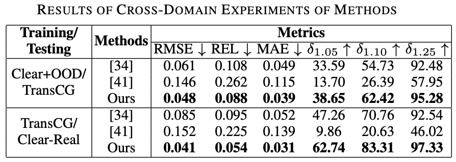

# Depth Filler Net (DFNet)

## Model

The architecture of our proposed end-to-end depth completion network DFNet is shown as follows. Our network utilizes a U-Net architecture with CDCD blocks, CDC blocks and CDCU blocks. These blocks are mainly composed of dense blocks, with DUC replacing deconvolution layer in up-sampling of CDCU block. All convolution layers except the last one are followed by batch normalizations and ReLU activations, and have 3 × 3 kernels.

**Note**. The final ReLU activations is used to guarantee that the refined depth is non-negative.

## Experiments

Experiments demonstrate superior efficacy, efficiency and robustness of our method over previous works, and it is able to process images of high resolutions under limited hardware resources, as shown in the following figures.

**Note**. In experiment tables above, ClearGrasp (or [34]) refers to "ClearGrasp: 3D Shape Estimation of Transparent Objects for Manipulation" (ICRA 2020), and LIDF-Refine (or [41]) refers to "RGB-D Local Implicit Function for Depth Completion of Transparent Objects" (CVPR 2021).

## References

1. Sajjan, Shreeyak, et al. "Clear grasp: 3d shape estimation of transparent objects for manipulation." 2020 IEEE International Conference on Robotics and Automation (ICRA). IEEE, 2020.
2. Zhu, Luyang, et al. "RGB-D Local Implicit Function for Depth Completion of Transparent Objects." Proceedings of the IEEE/CVF Conference on Computer Vision and Pattern Recognition. 2021.
