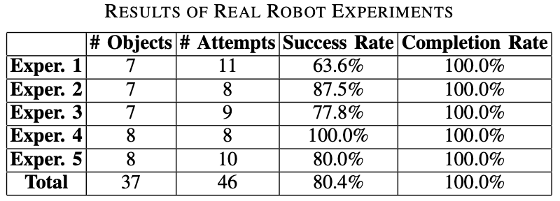

# Grasping

## Overview

Given an RGB image along with a depth image collected by an RGB-D camera, we first scale the images to an appro- priate size and feed into our depth completion model DFNet, which outputs the refined depth in the same resolution as the input. Then, the refined depth is scaled back to the original size, which can be used to construct the scene point cloud using camera intrinsics. After that, the scene point cloud is sent to [GraspNet-baseline](https://github.com/graspnet/graspnet-baseline) (CVPR 2020) as the input to the end-to- end grasp pose detection network. Finally, the grasp pose detection network outputs the grasp candidates, and the grasp will be executed by a parallel-jaw robot.

## Experiments

## Reference

1. Fang, Hao-Shu, et al. "Graspnet-1billion: A large-scale benchmark for general object grasping." Proceedings of the IEEE/CVF conference on computer vision and pattern recognition. 2020.
